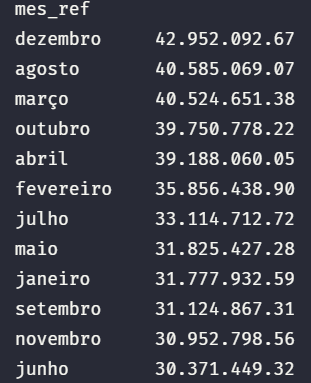

# 📊 Análise da Arrecadação Municipal – Olímpia/SP (2025)

## 📌 Objetivo

Este projeto tem como objetivo analisar a arrecadação municipal ao longo de 2025, identificando padrões de comportamento, crescimento mensal e principais fontes de receita.

---

## 🛠️ Tecnologias Utilizadas

* VS code com extensão do jupyter notebook
* Python
* Pandas
* Matplotlib
* pdfplumber
* re
* os

---

## 📂 Fonte dos Dados

Os dados foram extraídos de balancetes mensais em PDF da prefeitura, contendo informações detalhadas sobre receitas municipais.
abaixo esta o link de onde tirei os dados

https://www.olimpia.sp.gov.br/portal/contas_publicas/1/30/139/0/0/0/
---

## ⚙️ Etapas do Projeto

### 1. Extração de Dados
* Todos os pdfs começavam com "bal", tive que remover isso usando o powershell pois, estava dando erro
* Leitura de 12 PDFs (um para cada mês)
* Uso da biblioteca `pdfplumber` para extração de texto

### 2. Tratamento e Limpeza

* Uso de expressões regulares (regex) para estruturar os dados
* Conversão de valores financeiros (formato brasileiro → float)
* Padronização das colunas:

  * mês
  * código da receita
  * descrição
  * valor

### 3. Construção do Dataset

* Consolidação de todos os meses em um único DataFrame
* Organização temporal dos dados

---

## 📊 Análise Exploratória (EDA)

### 📈 Arrecadação por Mês

* Identificada variação significativa ao longo do ano
* Maior arrecadação em dezembro
* Menor arrecadação em junho

### 📉 Crescimento Mensal (%)

* Forte oscilação ao longo do ano
* Maior crescimento: **dezembro (+38,77%)**
* Maior queda: **setembro (-23,31%)**

### 📉 Grafico de Crescimento Mensal (%)

### 💰 Principais Fontes de Receita

Top 4 receitas:

1. Cota-Parte do ICMS
2. ISS (Imposto sobre Serviços)
3. Fundo de Participação dos Municípios (FPM)
4. O FUNDEB aparece como uma das receitas relevantes, indicando forte participação de transferências vinculadas à educação no orçamento municipal.

---

## 🧠 Principais Insights

* A arrecadação apresenta alta volatilidade ao longo do ano
* Há crescimento significativo no final do ano (efeito sazonal)
* A receita está concentrada em poucas fontes principais
* Existe dependência relevante de transferências governamentais (ICMS e FPM)

---

## 📌 Conclusão

A análise evidencia que a arrecadação municipal não é constante, sendo impactada por fatores sazonais e econômicos. Além disso, a concentração em poucas fontes de receita pode representar riscos em cenários de instabilidade econômica.

---

## 🚀 O que farei futuramente 

* Construção de dashboard no Power BI
* Análise comparativa com anos anteriores
* Previsão de arrecadação com modelos de Machine Learning

---

## 👨‍💻 Autor

João Pedro dos Santos Costa
